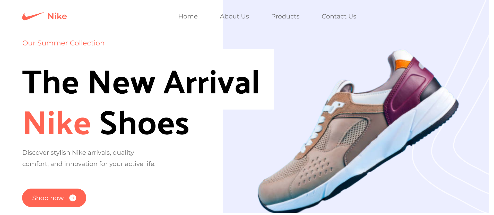
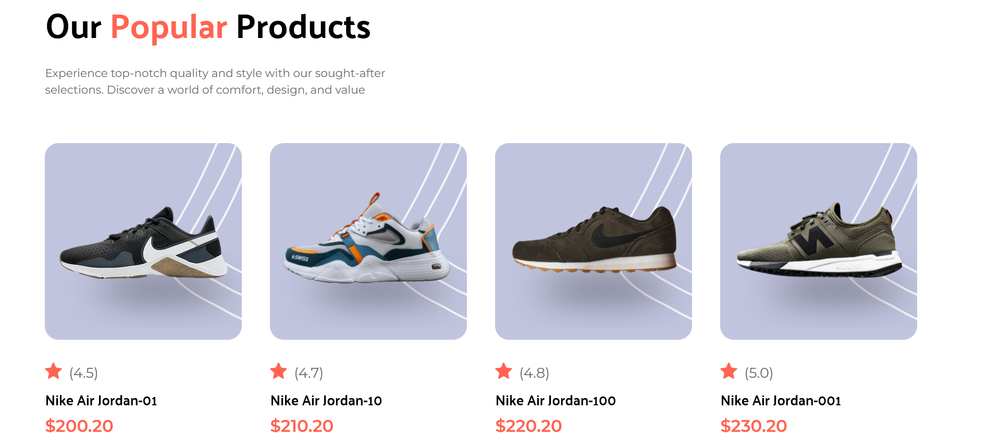
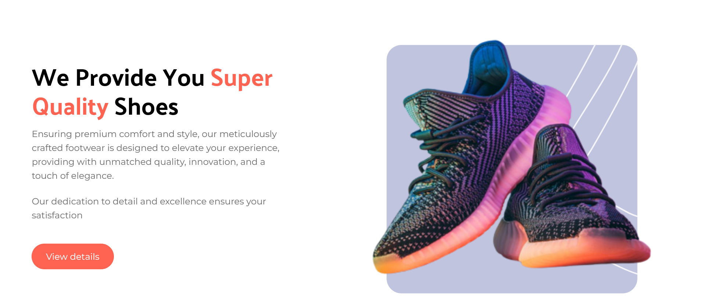
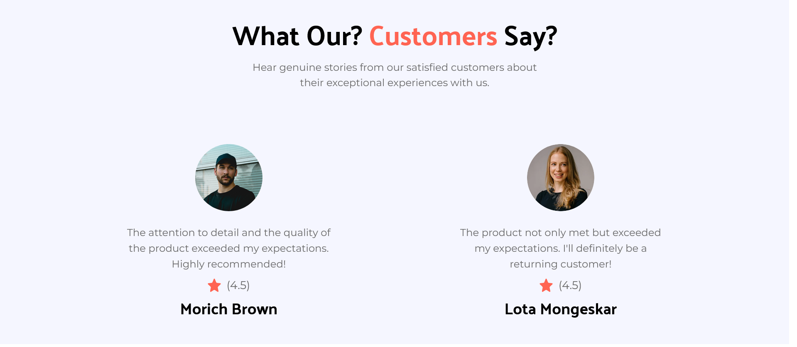
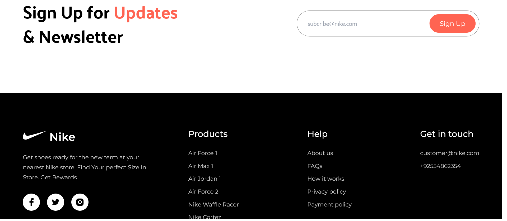

# Nike Tailwind Landing Page

Hi Future Developer!

Welcome to my latest project! This time, I've crafted a modern landing page using cutting-edge technologies - Tailwind CSS and Vite. This page focuses on showcasing Nike shoes in a stylish and responsive layout. It started as a template project, designed to present products with a cool and responsive look.

If you're interested in creating an attractive landing page with the latest web technologies, let's explore this project together!

*Thank you for your interest. Happy coding!*

## Powering Up with an Electrifying Tech Stack! ⚡

This project is fueled by an electrifying lineup of cutting-edge technologies:

- [Tailwind CSS](https://tailwindcss.com/) - Craft stylish and responsive interfaces effortlessly.
- [Vite](https://vitejs.dev/) - A blazing fast build tool for modern web development.

Prepare for an exhilarating ride through innovation and efficiency with this impressive tech stack!

## Licensing Groove🕺

Exciting news! This project is grooving to the rhythm of the [MIT License](https://github.com/novaardiansyah/next-tailwind-nike-web/blob/main/LICENSE)! 🎉

## Let's Connect! 📞

Need to chat? Feel free to drop me a line via [Email](mailto:novaardiansyah78@gmail.com) or hit me up on [WhatsApp](https://wa.me/6289506668480?text=Hi%20Nova,%20I%20have%20a%20question%20about%20your%20project%20on%20GitHub:%20https://github.com/novaardiansyah/next-tailwind-nike-web). I'm just a message away, ready to groove with you! 📩

## Sneak Peek 🌟

Get a glimpse of the app's enchanting world by exploring the current progress at [https://next-tailwind-nike-web.vercel.app](https://next-tailwind-nike-web.vercel.app). Feast your eyes on these snapshots that showcase the app's dynamic essence:

  
  

  
  

  
  

## Project Status 🚀 

